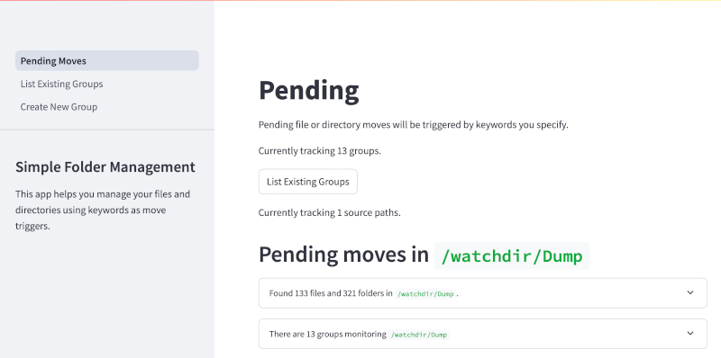

# Simple Folder Management
In [docker-compose.yaml](docker-compose.yaml) you can see `./testdir` being mapped to `/watchdir` in the container.
You'd want to replace `./testdir` with the directory you want to manage.

Run the following and you should find the app at [http://localhost:8501/](http://localhost:8501/).
```bash
docker-compose up
```

In the app itself you can create and manage groups as such:


Then you'll see the pending moves in the main view:

